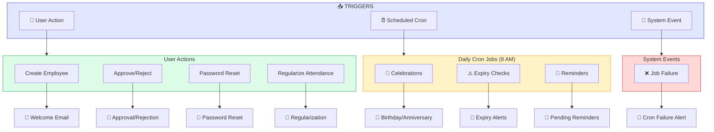
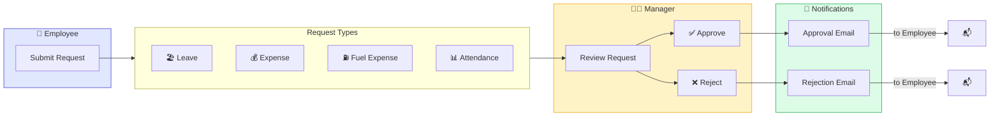
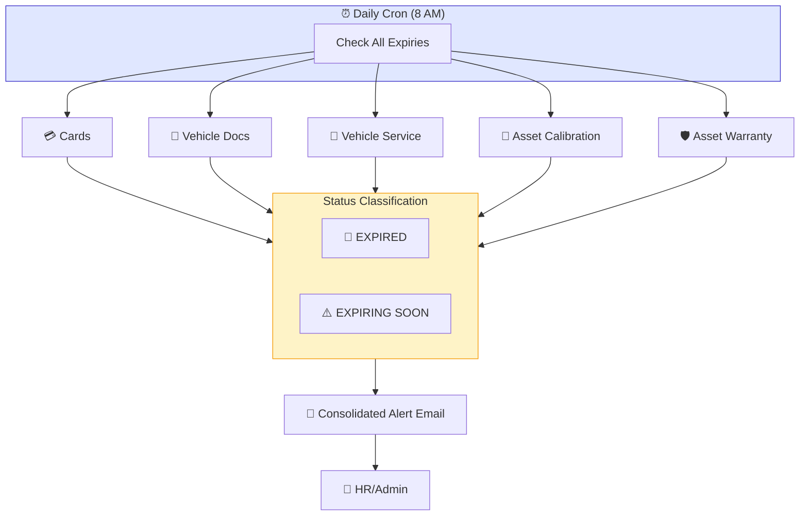
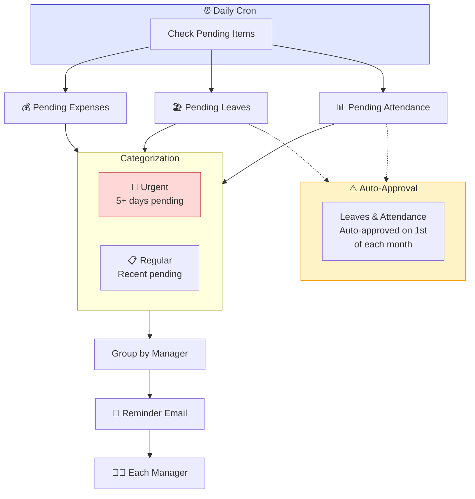
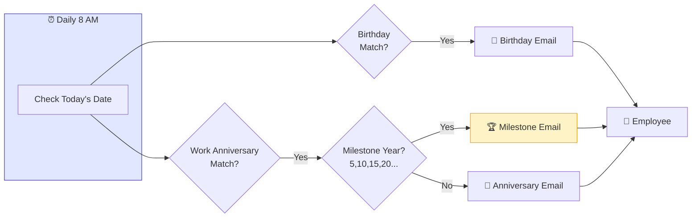
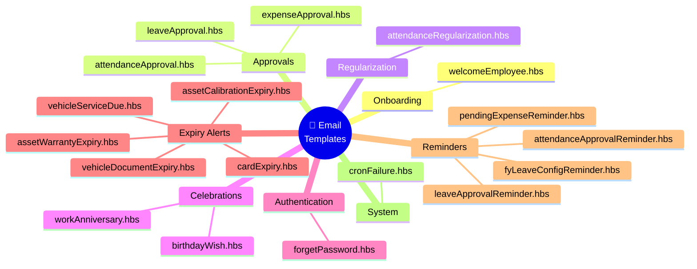
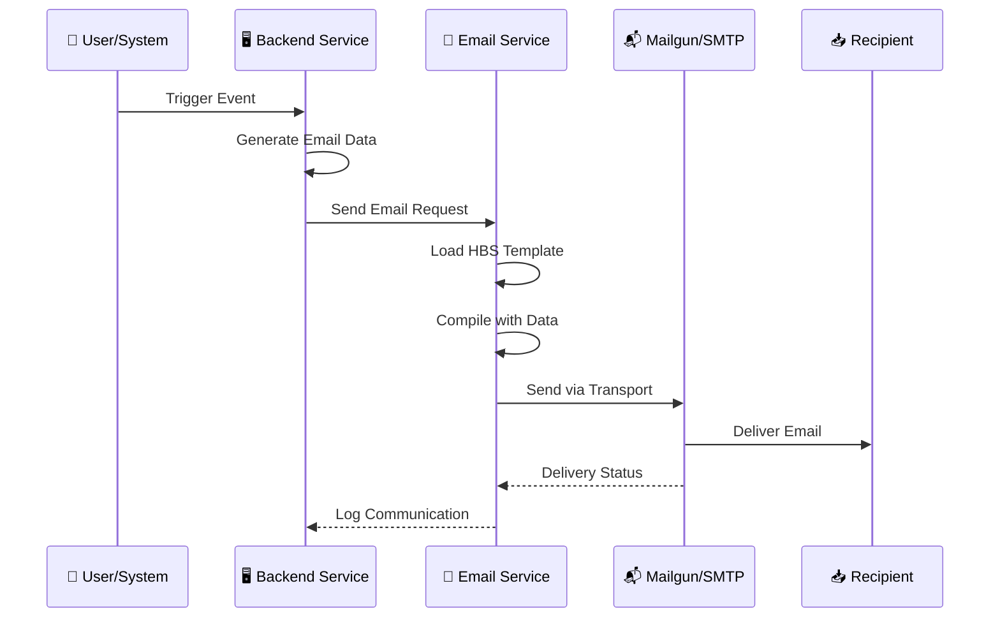
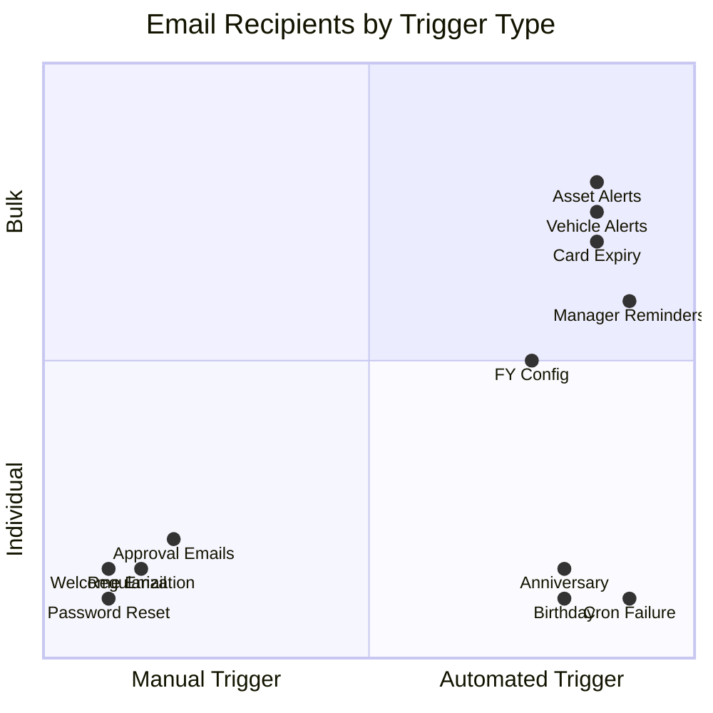

# Email Flow Diagrams (Mermaid)

> These diagrams can be viewed in GitHub, VS Code (with Mermaid extension), or [Mermaid Live Editor](https://mermaid.live)

---

## 🔄 Overall Email System Flow

---

## ✅ Approval Workflow

---

## ⏰ Daily Cron Schedule

```mermaid
gantt
    title Daily Email Cron Jobs (8:00 AM)
    dateFormat HH:mm
    axisFormat %H:%M

    section Celebrations
    Birthday Check      :08:00, 5m
    Anniversary Check   :08:05, 5m

    section Expiry Checks
    Card Expiry         :08:10, 5m
    Vehicle Docs        :08:15, 5m
    Vehicle Service     :08:20, 5m
    Asset Calibration   :08:25, 5m
    Asset Warranty      :08:30, 5m

    section Reminders
    Expense Reminder    :08:35, 5m
    Leave Reminder      :08:40, 5m
    Attendance Reminder :08:45, 5m
```

---

## ⚠️ Expiry Alert Categories

---

## 📝 Manager Reminder Flow

---

## 🎉 Celebration Email Flow

---

## 📧 Email Template Mapping

---

## 🔄 Complete Email Lifecycle

---

## 📊 Email Recipient Matrix

---

_View these diagrams at [mermaid.live](https://mermaid.live) or in VS Code with Mermaid extension_
